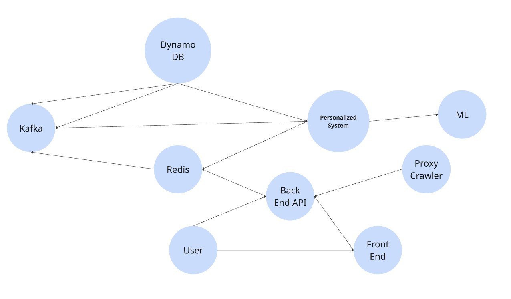

# News Recommendation System
## Overview
This project is a **news recommendation system** that provides personalized news recommendations to users. It utilizes **Flask** as the backend, **React** as the frontend, **DynamoDB** for data storage, and **Kafka** for message queuing. Machine learning algorithms are employed to enhance recommendation quality.

## Features
- **News Scraping**: Uses Python crawlers to collect BBC news articles.
- **Data Storage**: Stores news articles and user interactions in **DynamoDB**.
- **Recommendation Algorithm**: Implements **Collaborative Filtering** (SVD, Item-based CF) and **Content-based Recommendation**.
- **Backend API**: Flask-based API that delivers news recommendations to users.
- **Frontend**: A React-based UI that displays categorized news and recommendations.
- **Caching Optimization**: Uses **Redis** to cache frequently accessed news data.
- **High Concurrency Support**: Utilizes **Kafka** for message processing and Redis for reducing database load.

## System Architecture
1. **Data Collection**:
    - Python crawler fetches BBC news articles and sends them to Kafka.
    - Kafka streams data into DynamoDB for storage.
2. **Data Processing & Storage**:
    - DynamoDB stores articles and user data.
    - Redis caches hot articles to enhance query efficiency.
3. **Recommendation Engine**:
    - User activity logs feed into the recommendation system.
    - Machine learning models process user preferences to suggest articles.
4. **Backend & API**:
    - Flask API provides endpoints for retrieving news and recommendations.
    - The system supports user authentication and browsing history tracking.
5. **Frontend**:
    - A React-based UI that displays categorized news and personalized recommendations.

## Installation & Setup
### Prerequisites
Ensure you have the following installed:

- Python 3.x
- Node.js 16+
- Flask
- DynamoDB (AWS setup required)
- Kafka (Local or cloud setup)
- Redis
### Backend Setup
1. Clone the repository:
    ```
    git clone https://github.com/your-repo/news-recommendation.git
    cd news-recommendation/backend
    ```
2. Install dependencies:
    ```
    pip install -r requirements.txt
    ```
3. Set up environment variables in a `.env` file:
    ```
    AWS_ACCESS_KEY=your_key
    AWS_SECRET_KEY=your_secret
    DYNAMODB_REGION=us-west-1
    ``` 
4. Run the Flask server:
    ```
    python3 server.py
    ```
### Frontend Setup

1. Navigate to the frontend directory:
    ```
    cd ../frontend
    ```
2. Install dependencies:
    ```
    npm install
    ```
3. Start the development server:
    ```
    npm run dev
    ```
## API Endpoints
| Method | Endpoint | Description |
| --- | --- | --- |
| GET | `/news` | Get latest news articles |
| GET | `/recommendations?user_id=<id>` | Get personalized recommendations |
| POST | `/user/activity` | Log user activity |

## Future Improvements
- Add real-time recommendation updates.
- Expand dataset to more news sources.
- Improve recommendation model with NLP/ML techniques.

# Node2Vec Combined with PageRank for Weight Adjustment 

## Method
1. **Compute News Content Similarity**:
   - Use **TF-IDF** to extract text features from news articles.
   - Calculate **cosine similarity** to measure the semantic closeness between articles.

2. **Construct a News-Graph (News-to-News Network)**:
   - Represent news articles as **nodes** in the graph.
   - Establish **edges** between similar articles, with weights based on their TF-IDF similarity score.

3. **Apply PageRank to Compute News Importance**:
   - Run the **PageRank algorithm** to determine the relative importance of each news article.
   - Higher PageRank scores indicate more significant articles, which should be prioritized in recommendations.

4. **Incorporate Node2Vec for Learning News Embeddings (Optional)**:
   - Use **Node2Vec to generate vector representations (embeddings) of news articles**, capturing deeper structural relationships.
   - Employ **KNN or MLP models** to refine recommendations based on learned embeddings.

---

## Use Cases
**Content-Based Recommendation**: Enhances recommendations by leveraging both **news content and structure**, rather than solely relying on user interaction data.  
**Cold Start Problem**: Helps recommend relevant news articles even for new users with limited interaction history.  
**Graph-Based AI Optimization**: Provides a structured way to rank and recommend news using **graph-based learning techniques**.

